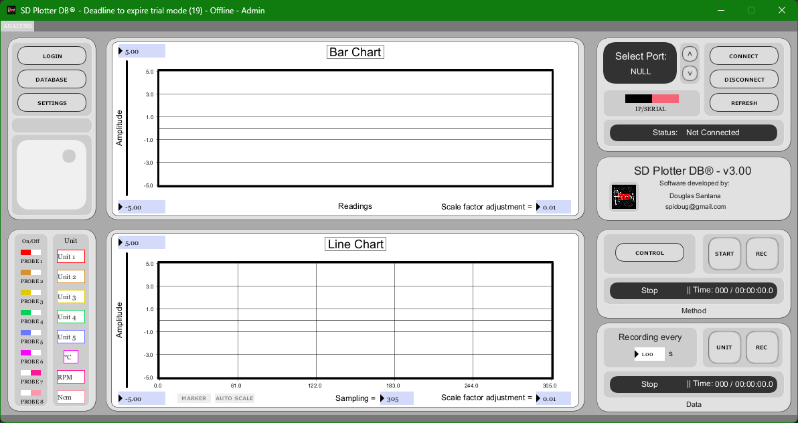
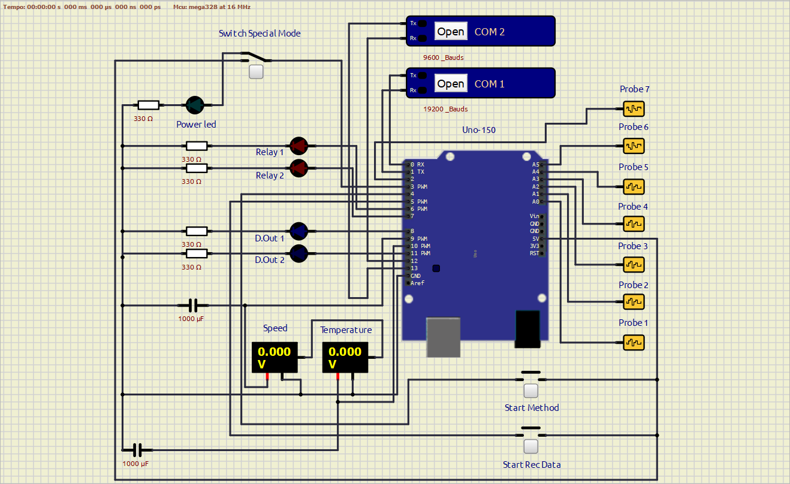

# SD Plotter DB - Version 3.0


**SD Plotter DB** is a desktop data acquisition, plotting, recording and control system designed to communicate with Arduino-based hardware. It can acquire analog signals, record data in `.CSV` files, save analysis data to an embedded database, count speed using an interrupt input when an encoder is connected, and control digital/PWM outputs for automation tasks.

The software was developed for industrial automation and is registered with INPI/Brazil under **BR 5120240025715**. Its original application focus is the management of a pilot plant for the chemical industry, but because probe names, units, calibration parameters and operating settings can be customized, the platform can be adapted to many instrumentation, monitoring and process-control scenarios.



## Download compiled program

The compiled Windows `.exe` release is distributed externally:

- Archive.org: https://archive.org/details/SDPlotterDB
- MEGA: https://mega.nz/folder/jaADBYxC#lnP73pgNESMqjK755NiX3Q

This repository is organized for documentation, source review, firmware maintenance and GitHub publication. The compiled installer is not stored directly in this repository.

## Main features

- Real-time signal acquisition from Arduino analog inputs.
- Support for Arduino UNO, NANO and MEGA-based controller firmware.
- Serial communication through USB/emulated serial ports.
- LAN/IP communication for the Arduino MEGA Ethernet firmware.
- Real-time bar graphs and time graphs.
- Optional instantaneous monitor window for processed signal values.
- Renameable probes/sensors and user-defined measurement units.
- Linear calibration through span and zero parameters.
- Software and hardware smoothing options.
- Data recording and export in `.CSV` format.
- Embedded database support for analysis data, methods, snapshots and logs.
- Method recording and method playback for actuator sequences.
- PID-related parameters for temperature and speed control.
- Encoder-based speed measurement through interrupt counting.
- Digital output, relay and PWM actuator control.
- Condition-based relay/method activation.
- External event inputs for starting data recording and method playback.
- Demo mode for signal simulation.
- User management with administrator and non-administrator roles.
- Optional Windows authentication mode.
- Keyboard shortcuts for fast industrial operation.

## Repository structure

```text
.
├── README.md
├── LICENSE
├── NOTICE.md
├── CHANGELOG.md
├── CONTRIBUTING.md
├── SECURITY.md
├── docs/
│   ├── INSTALLATION.md
│   ├── USER_GUIDE.md
│   ├── FIRMWARE_AND_HARDWARE.md
│   ├── DATABASE_AND_EXPORT.md
│   ├── KEYBOARD_SHORTCUTS.md
│   ├── DEVELOPMENT.md
│   ├── RELEASES.md
│   ├── PROJECT_STRUCTURE.md
│   ├── images/
│   └── manuals/
├── firmware/
│   ├── arduino-with-ethernet/
│   └── arduino-without-ethernet/
└── src/
    └── processing/
        └── SDPlotterDB/
```

## Hardware overview

| Firmware folder | Target use |
| --- | --- |
| `firmware/arduino-without-ethernet/` | USB/serial operation for Arduino UNO/NANO style installations. |
| `firmware/arduino-with-ethernet/` | Arduino MEGA operation with Ethernet/LAN communication support. |

The controller reads analog probes from `A0` to `A5`, uses digital inputs for external actions, supports an interrupt input for encoder/speed counting, and controls digital/PWM outputs for actuators.



More details are available in [Firmware and Hardware](docs/FIRMWARE_AND_HARDWARE.md).

## Software operation overview

A typical workflow is:

1. Install or download the compiled Windows program.
2. Open SD Plotter DB.
3. Log in with an administrator user.
4. Configure the license, if required.
5. Enter calibration mode when sensor parameters, firmware loading or EEPROM writing must be configured.
6. Select the COM port or LAN mode.
7. Configure sensor names, units, span, zero, smoothing, PID and motor parameters.
8. Upload or update the Arduino firmware when needed.
9. Save controller parameters to EEPROM when required.
10. Reopen the software in normal operation mode.
11. Connect to the hardware.
12. Select sampling and recording parameters before connection.
13. Monitor real-time signals.
14. Record analysis data, export `.CSV` files, record methods or reproduce saved methods.

See the full [User Guide](docs/USER_GUIDE.md).

## Default administrative login

The original manual defines the default administrative access as:

```text
Username: Admin
Password: 12345
```

For any public, industrial or shared installation, change this password immediately and create separate named users.

## Documentation

- [Installation](docs/INSTALLATION.md)
- [User Guide](docs/USER_GUIDE.md)
- [Firmware and Hardware](docs/FIRMWARE_AND_HARDWARE.md)
- [Database and CSV Export](docs/DATABASE_AND_EXPORT.md)
- [Keyboard Shortcuts](docs/KEYBOARD_SHORTCUTS.md)
- [Development Notes](docs/DEVELOPMENT.md)
- [Release Links](docs/RELEASES.md)
- [Project Structure](docs/PROJECT_STRUCTURE.md)

The original Word manual is also included at:

```text
docs/manuals/Instruction Manual - SD PLOTTER DB.docx
```

## Source overview

The desktop application source is a Processing sketch located in:

```text
src/processing/SDPlotterDB/
```

The Arduino firmware is located in:

```text
firmware/arduino-without-ethernet/
firmware/arduino-with-ethernet/
```

## Dependencies

Desktop source:

- Processing IDE.
- Processing Serial library.
- ControlP5 library.
- Grafica library.
- Java SQL classes.
- Apache Derby JAR files included in `src/processing/SDPlotterDB/code/`.

Arduino firmware:

- Arduino IDE.
- TimerOne library.
- EEPROM library.
- SoftwareSerial library for the serial firmware.
- SPI and Ethernet libraries for the Ethernet firmware.

## Important safety note

This project can interact with physical equipment, actuators, relays, PWM outputs and industrial process signals. Test first with disconnected loads or safe bench hardware. Validate wiring, voltage levels, grounding, isolation, emergency stop behavior and output states before connecting to real machinery or chemical-process equipment.

## Intellectual property and license

SD Plotter DB is identified by the author as registered with INPI/Brazil under **BR 5120240025715**. This repository includes a conservative **All Rights Reserved** license file. Replace it only if the author intentionally chooses a different licensing model.

## Academic reference

This project was idealized from the following academic final course work:

https://publicacoes.even3.com.br/tcc/desenvolvimento-de-um-registrador-de-dados-aplicado-no-monitoramento-e-controle-de-atuadores-para-uso-em-processos-quimicos-1368024

## Author

Developed by **Douglas Santana da Silva**.

Contact: `spidoug@gmail.com`
