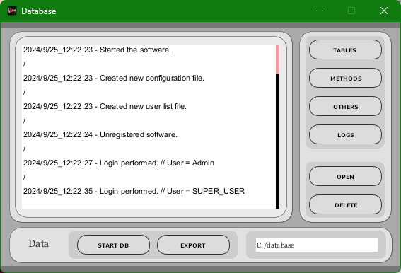
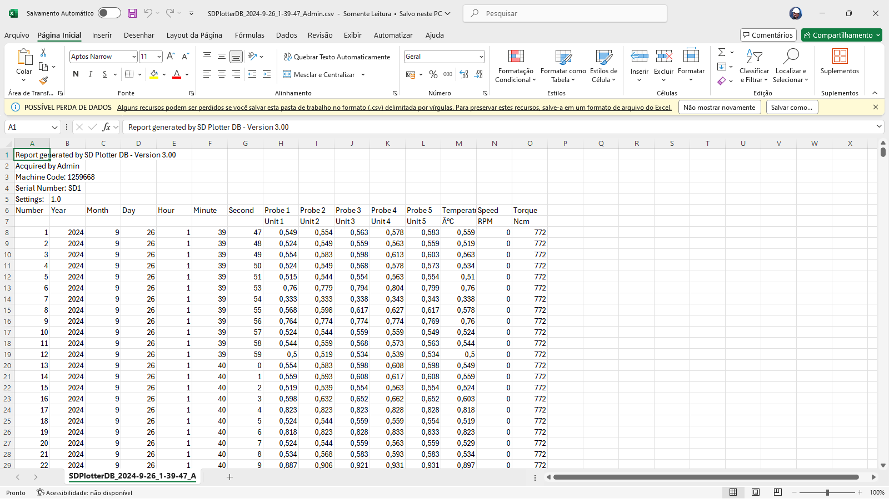

# Database and CSV Export

SD Plotter DB can record analysis data, method data, snapshots and system logs. It also supports `.CSV` export for spreadsheet analysis.

## Database screen

The database screen includes views for system logs, tables/analysis data, methods and generated snapshots.

## Tables

The **TABLES** button displays the list of analysis data files. These files can be opened or deleted through the interface. Double-clicking the analysis data text box or pressing `F8` can generate a snapshot.

## Export

The **EXPORT** button exports the selected data file to a folder named `exported/`. The exported file uses `.CSV` structure.

## Methods

The **METHODS** button displays recorded methods. Methods can be reproduced or deleted. A method stores actuator behavior over time, allowing a process sequence to be replayed later.

## Data folder

The original manual states that recording data files are available in the `data` folder located inside the software installation folder.

## Starting the database

In calibration mode, pressing **START DB** starts a database at the configured location.

Important behavior:

- The database records analysis data, methods and system logs.
- After enabling a database, it can no longer be disabled or have its save location changed through the normal flow.
- The system closes and must be opened again after starting the database.
- **START DB** can only be activated by an administrator while disconnected.

## Database export

The database **EXPORT** action can generate an instant folder containing the data present in the database. It can only be used by an administrator while the system is disconnected.

## Backup and restore

Recommended backup practice:

1. Stop acquisition and method playback.
2. Disconnect the controller.
3. Close SD Plotter DB.
4. Copy the full database/data folder to a timestamped backup directory.
5. Store the backup outside the installation folder.
6. Reopen SD Plotter DB and confirm data visibility.

## CSV usage recommendations

Keep original exported files unchanged, make copies before editing, document sampling rate and sensor calibration, and keep method files and analysis files together when they belong to the same experiment.
