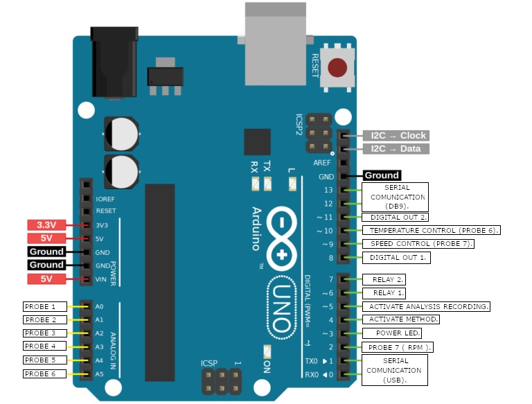
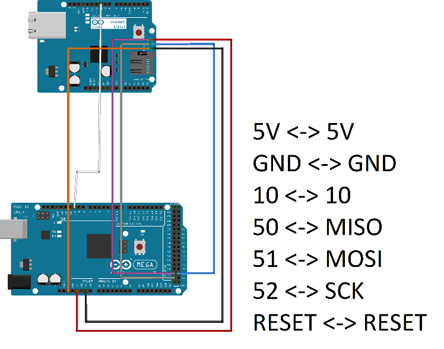

# Firmware and Hardware

This document describes the repository firmware layout and the hardware assumptions used by SD Plotter DB Version 3.0.

## Firmware folders

```text
firmware/
├── arduino-with-ethernet/
└── arduino-without-ethernet/
```

Each firmware folder includes the main `SDPlotterDB/` sketch, the `apagar_eeprom/` EEPROM cleaning sketch, a firmware ZIP package and a TimerOne dependency ZIP package.

## Firmware variants

### Without Ethernet

Path: `firmware/arduino-without-ethernet/SDPlotterDB/`

Main use: Arduino UNO/NANO style operation through USB/serial communication.

Includes:

```cpp
#include <TimerOne.h>
#include <SoftwareSerial.h>
#include <EEPROM.h>
```

### With Ethernet

Path: `firmware/arduino-with-ethernet/SDPlotterDB/`

Main use: Arduino MEGA operation with LAN/IP communication and Ethernet web interface.

Includes:

```cpp
#include <TimerOne.h>
#include <EEPROM.h>
#include <SPI.h>
#include <Ethernet.h>
```

## EEPROM clearing

Before recording the main SD Plotter DB firmware, the original manual recommends recording the EEPROM clearing sketch.

Workflow:

1. Connect the Arduino/controller to the computer.
2. Open the relevant `apagar_eeprom` sketch.
3. Select the board and port in Arduino IDE.
4. Upload the sketch.
5. After EEPROM cleanup, upload the main `SDPlotterDB` firmware.

## Firmware upload from SD Plotter DB

The desktop software supports firmware loading through serial mode from calibration mode using the **HEX** button. EEPROM-related actions use the **EEPROM** and **STD** positions. Select the correct COM port and click **CONNECT** to start the procedure. Click **DISCONNECT** before connecting to cancel a pending action.

## Arduino board selection

The software can work with Arduino UNO, NANO and MEGA. By default, firmware recording is configured for Arduino UNO. To change the target to Arduino MEGA or Arduino NANO, adjust the relevant settings file in the software root folder as described by the original manual.

## Signal inputs

| Probe | Arduino input |
| --- | --- |
| Probe 1 | `A0` |
| Probe 2 | `A1` |
| Probe 3 | `A2` |
| Probe 4 | `A3` |
| Probe 5 | `A4` |
| Probe 6 | `A5` |

These probes can be renamed in the software and converted into engineering units using span and zero parameters.

## Digital and PWM pins in the serial firmware

| Function group | Pin |
| --- | --- |
| Interrupt/speed input | `D2` |
| Digital input / configurable behavior | `D3` |
| Digital input | `D4` |
| Digital input | `D5` |
| Digital output | `D6` |
| Digital output | `D7` |
| Digital output | `D8` |
| PWM / analog output 2 | `D9` |
| PWM / analog output 1 | `D10` |
| Digital output | `D11` |
| Software serial TX | `D12` |
| Software serial RX | `D13` |

## Digital and PWM pins in the Ethernet firmware

| Function group | Pin |
| --- | --- |
| Interrupt/speed input | `D2` |
| Digital input / configurable behavior | `D3` |
| Digital input | `D4` |
| Digital input | `D5` |
| Digital output | `D6` |
| Digital output | `D7` |
| Digital OUT 1 | `D8` |
| Digital OUT 2 | `D9` |
| PWM / temperature control output | `D11` |
| PWM / speed control output | `D12` |

The original manual specifically notes that, for Arduino MEGA LAN communication, temperature control for Probe 6 is on pin `11`, speed control for Probe 7 is on pin `12`, Digital OUT 1 is on pin `8`, and Digital OUT 2 is on pin `9`.

## Encoder and speed counting

The firmware uses an interrupt input for counting speed pulses. This is intended for encoder-based speed measurement. Motor-related configuration fields include maximum speed, encoder count/CPR and motor power in watts.

## Hardware diagrams






## Safety recommendations

Before connecting real actuators or industrial equipment, validate all pin assignments, use proper relay/motor/heater drivers, protect inductive loads, add emergency-stop hardware, test with dummy loads and confirm fail-safe states after reset or disconnection.
