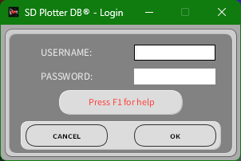

# Installation

This document explains how to install and start SD Plotter DB Version 3.0 from the compiled Windows program and how to prepare the environment for source-level work.

## Installing the compiled Windows program

The compiled program is distributed externally:

- Archive.org: https://archive.org/details/SDPlotterDB
- MEGA: https://mega.nz/folder/jaADBYxC#lnP73pgNESMqjK755NiX3Q

After downloading the installer:

1. Run the installer.
2. Click **Next** on the welcome screen.
3. Choose the installation folder.
4. Enable the option to create a desktop shortcut, if desired.
5. Confirm the installation summary.
6. If the program is already open during reinstall, close SD Plotter DB before continuing.
7. Wait for the installer to copy all files.
8. Finish the installer.
9. Open SD Plotter DB from the Windows Start Menu or from the desktop shortcut.

## First login



Default administrator credentials from the original manual:

```text
Username: Admin
Password: 12345
```

After the first login, change the administrator password and create separate user accounts for operators.

## Trial and license information

The original manual states that the first installation has a limited number of trial uses. The settings screen displays a machine code and a license field.

To register the program:

1. Open SD Plotter DB.
2. Click **SETTINGS**.
3. Locate the license field and the machine code.
4. Send the machine code to the author contact email.
5. Enter the received license in the license field.

If the trial period has ended, the license field is highlighted.

## Recommended Windows configuration

For industrial data acquisition, stable communication is essential. The original manual recommends disabling USB power suspension so that the operating system does not interrupt communication with the controller.

Recommended actions:

1. Open Windows power settings.
2. Disable USB selective suspend.
3. Use a reliable USB cable.
4. Avoid USB hubs for critical operation.
5. Keep the Arduino/controller on a stable power supply.
6. Confirm that the correct serial driver is installed.

## Source-level setup

The desktop source is a Processing project.

Recommended setup:

1. Install the Processing IDE.
2. Open `src/processing/SDPlotterDB/`.
3. Make sure ControlP5, Grafica and Serial support are available.
4. Keep the `code/` folder in place. It contains the Apache Derby JAR files used by the application.
5. Run the main sketch file: `SDPlotterDB.pde`.

## Arduino IDE setup

For firmware work:

1. Install Arduino IDE.
2. Install the TimerOne library.
3. Open the correct firmware folder:
   - `firmware/arduino-without-ethernet/SDPlotterDB/`
   - `firmware/arduino-with-ethernet/SDPlotterDB/`
4. Select the correct Arduino board and COM port.
5. Compile and upload.

For EEPROM cleaning, open the `apagar_eeprom` sketch in the relevant firmware folder and upload it before uploading the main SD Plotter DB firmware.
