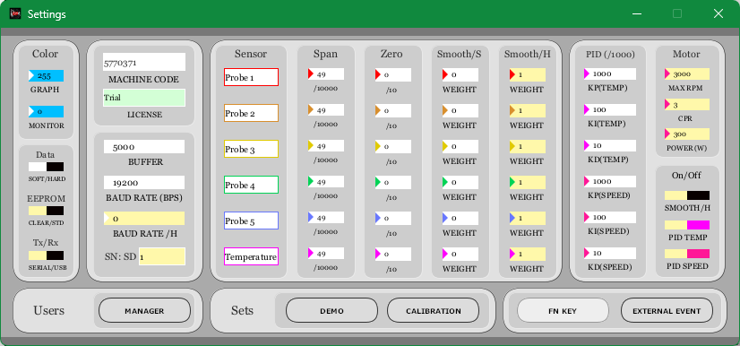
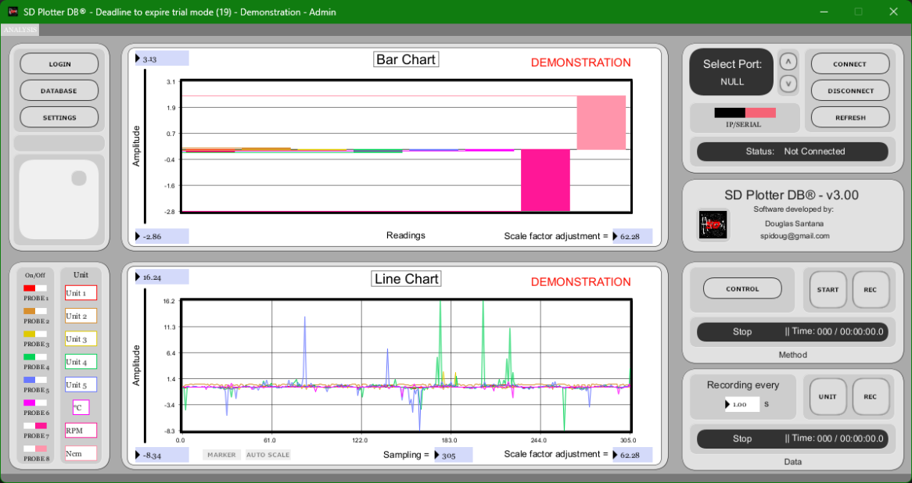

# User Guide

This guide explains the main operating workflow for SD Plotter DB Version 3.0.

## Purpose

SD Plotter DB is used to monitor, record and control signals from a microcontroller running dedicated firmware. The platform can acquire sensor values, display them as real-time graphs, record data, export CSV files, store analysis information in a database, record actuator methods, replay methods and control outputs.

## Main screen

The main interface contains real-time graph areas, connection controls, probe enable/disable controls, recording controls and access buttons for database, settings and control screens.

## Operating modes

### Normal operation mode

Use normal operation mode for connecting to the controller, monitoring probes, recording analysis data, recording/reproducing methods, exporting data and viewing previous files and logs.

### Calibration mode

Use calibration mode for editing sensor names, units, span/zero values, smoothing parameters, PID parameters, motor parameters, writing parameters to Arduino EEPROM, loading firmware and clearing EEPROM.

When SD Plotter DB is in calibration mode, login is disabled. After finishing calibration procedures, close and reopen the software so that normal operation and auto-scale behavior are restored.

## Initial configuration workflow

1. Open the program.
2. Log in as an administrator.
3. Open **SETTINGS**.
4. Enter license data if required.
5. Enable **CALIBRATION** mode.
6. Configure communication mode.
7. Configure sensor names and units.
8. Configure span and zero values.
9. Configure smoothing values.
10. Configure PID and motor fields if the actuator system uses them.
11. Write firmware or EEPROM parameters if required.
12. Close and reopen the program in normal mode.
13. Connect to the controller.
14. Start monitoring and recording.

## Settings screen

Important settings groups:

| Group | Function |
| --- | --- |
| DATA | Defines whether parameters are obtained from Arduino memory or saved/used on the PC. |
| Tx/Rx | Defines the communication path between Arduino/controller and PC. |
| SN SD | Equipment identification. |
| SENSOR | Display names for connected probes. |
| SPAN and ZERO | Linear calibration values used to plot sensor signals. |
| SMOOTH/S | Software smoothing calculated by the PC application. |
| SMOOTH/H | Hardware smoothing calculated by Arduino. |
| PID | Proportional, integral and derivative parameters for temperature and speed control. |
| MOTOR | Maximum speed, encoder count/CPR and motor power in watts. |
| EXTERNAL EVENT | Enables external Arduino signals to start recording or method playback. |
| FN KEY | Enables or disables shortcut keys. |
| DEMO | Simulates sensor signals. |
| MANAGER | Creates users, deletes users and configures administrator privileges. |

The hardware baud-rate modes are:

| Mode | Baud rate |
| --- | --- |
| `0` | 19200 bps |
| `1` | 38400 bps |
| `2` | 57600 bps |
| `3` | 115200 bps |

## Probe configuration

Probe names and units can be customized. Disabling probes affects the data that is recorded. Probes 1 to 6 can have parameters saved to the Arduino. Probe visibility also affects graphs and exported analysis data.

## Connecting to the controller

Before connecting:

1. Choose the sampling rate.
2. Choose the time/data recording rate.
3. Select the COM port or LAN mode.
4. Confirm that the Arduino firmware matches the selected communication mode.
5. Confirm that no firmware/EEPROM writing action is accidentally enabled.

After the system connects, the sampling rate cannot be changed until disconnection.

## Serial communication

Use serial mode for Arduino UNO/NANO and serial-based MEGA operation. Select the correct COM port and click **CONNECT** or press `ENTER`. If no COM ports are available, the port selector shows a null state.

## LAN/IP communication

LAN communication is implemented for Arduino MEGA firmware. When IP communication is active, the software displays IP-related fields instead of serial buffer and baud-rate fields. When connecting through IP, the system opens the default web browser at the configured IP address.

Through the browser page, it is possible to monitor probes, test relay/digital outputs and use browser buttons to start and stop recording.

## Monitor function

The monitor function displays instantaneous processed signal values. It can be enabled or disabled by double-clicking the center of the upper graph while connected or by pressing the corresponding function key.

## Marker function

The marker button adds a cross marker on the time graph. It helps monitor signal amplitude relative to time and can also track bar-graph values through a line connected to the Y axis.

## Recording analysis data

1. Connect to the controller.
2. Confirm probe selection.
3. Confirm sampling and recording rates.
4. Start recording from the interface or shortcut key.
5. Stop recording when the analysis is complete.
6. Export or inspect the resulting data through the database/display tools.

## Recording and playing methods

A method is a recorded actuator sequence that can be reproduced later.

The control screen supports recording and playback of Probe 6 control, Probe 7 control, Digital OUT 1 and Digital OUT 2. Relay 1 and Relay 2 are instant commands.

When a method is played, the preview screen displays a guide indicating the current position over time. For very long methods with few actuator variations, the preview graph can be switched to logarithmic scale by clicking the screen or pressing `ENTER`.

## Condition-based automation

The condition screen controls Relay 1 and Relay 2 based on probe values reaching configured conditions. It can also select up to two methods to reproduce based on a prepared condition.

## Recommended shutdown workflow

1. Stop recording.
2. Stop method playback.
3. Disable actuators or return them to a safe state.
4. Disconnect SD Plotter DB.
5. Confirm that output hardware is safe.
6. Close the application.
